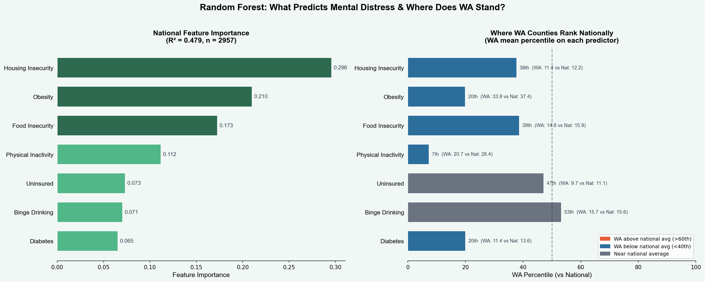
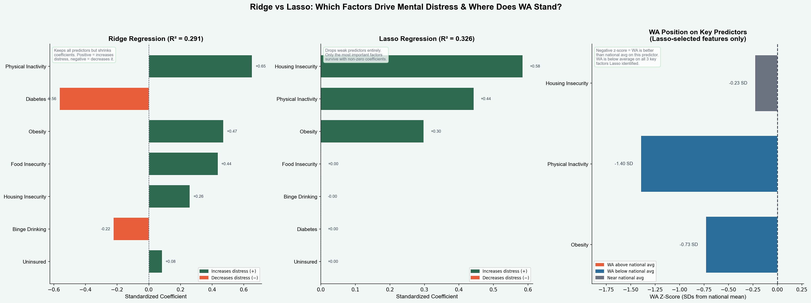
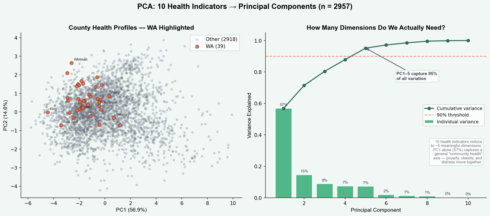
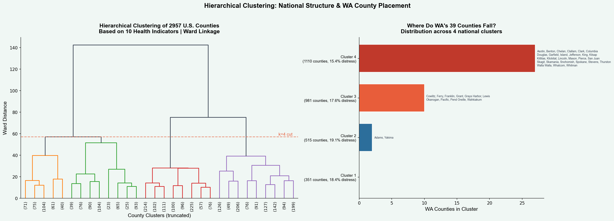
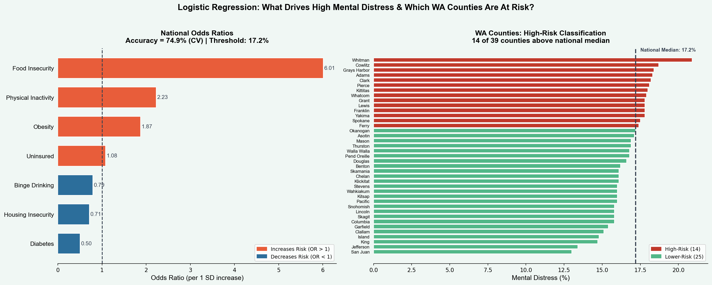
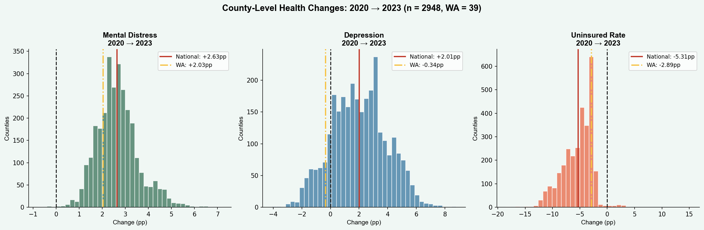

# Youth Mental Health Access Analysis — Washington State

County-level analysis of youth mental health access gaps, provider shortages, and socioeconomic risk factors across all 39 Washington counties — with national ML benchmarking across 2,957 U.S. counties.

**Author:** Waleed Adawi · **Year:** 2026
**Internship:** Washington State Community Connectors (WSCC) · Spring 2026
**Stack:** Python 3 · pandas · NumPy · Matplotlib · Seaborn · scikit-learn · SciPy

---

## Overview

### The Problem

Rural and low-income communities in Washington State face disproportionate barriers to youth mental health care. Provider shortages, high uninsured rates among children, and poverty create compounding access gaps that vary dramatically from county to county. But descriptive analysis of 39 WA counties alone cannot answer a critical question: are the factors driving mental distress in Washington the same ones driving it nationally, and how do WA's counties compare to the rest of the country?

### Why It Matters

Washington has 39 counties spanning dense urban centers like King County (2.3M residents, 380 MH providers per 100K) to remote rural areas like Garfield County (2,200 residents, 40 providers per 100K). Understanding where access breaks down — and what factors are associated with those gaps — is the first step toward equitable resource allocation.

This project was developed during a Spring 2026 internship with Washington State Community Connectors (WSCC), an organization that works to bridge gaps in health and social services across Washington's rural and underserved communities. The analysis directly supports the kind of evidence-based work that informs WSCC program planning, grant reporting, and advocacy.

### Objective

This project has two phases. **Phase 1** quantifies the relationships between socioeconomic indicators (income, poverty, insurance coverage), mental health outcomes (youth diagnosis rates, sadness prevalence, adult mental health burden, child maltreatment), and mental health provider availability across WA's 39 counties using descriptive statistics, correlation analysis, and unsupervised clustering. **Phase 2** scales the analysis to 2,957 U.S. counties using five supervised and unsupervised ML models to identify which health indicators are the strongest national predictors of mental distress, and benchmarks WA's 39 counties against that national picture.

---

## Methodology

### Approach

**Phase 1 (WA County Analysis)** uses a single self-contained Python script (`Code.py`) with all county-level data embedded directly. No external CSV files or databases are required. The analytical pipeline includes descriptive statistics across all 39 counties, distribution analysis, rural vs. urban disparity comparisons, Pearson correlation analysis, a manually implemented K-means clustering algorithm (k=3, no scikit-learn) for risk profiling, and a hex cartogram for geographic visualization.

**Phase 2 (National ML Benchmarking)** uses a second script (`ML_Analysis.py`) that pulls county-level health data for ~3,000 U.S. counties from the CDC PLACES API, adds USDA rural/urban codes, and trains five ML models — Random Forest, Ridge/Lasso Regression, PCA, Hierarchical Clustering, and Logistic Regression — to identify the strongest national predictors of mental distress and contextualize WA's 39 counties within the national distribution.

### Tools

| Tool | Purpose |
|------|---------|
| pandas | Data manipulation and summary statistics |
| NumPy | Array operations and from-scratch K-means |
| Matplotlib / Seaborn | All figure generation (17 outputs) |
| scikit-learn | Random Forest, Ridge, Lasso, Logistic Regression, PCA |
| SciPy | Hierarchical clustering and dendrogram |
| CDC PLACES API | National county-level health estimates (2,957 counties) |
| Leaflet.js | Interactive choropleth map |

---

## Data Processing

### Data Sources

**Phase 1** — County-level indicators were compiled from 11 federal sources:

| Source | Tables / Dataset | Variables |
|--------|-----------------|-----------|
| U.S. Census ACS 5-Year (2019-2023) | S2701, S1701, S1901, B01003, B03003 | Youth uninsured rate, child poverty, median income, population, Hispanic % |
| HRSA Area Health Resource File (2023) | AHRF | Mental health provider rate per 100K |
| USDA Rural-Urban Continuum Codes (2023) | RUCC | Metro/non-metro county classification |
| NSCH (National Survey of Children's Health) | 2022-2023 | Youth anxiety/depression diagnosis rate; caregiver access difficulty |
| YRBSS (Youth Risk Behavior Surveillance System) | 2023 | Youth sadness/hopelessness prevalence |
| BRFSS (Behavioral Risk Factor Surveillance System) | 2023 | Adult mentally unhealthy days |
| NCANDS (National Child Abuse and Neglect Data System) | 2023 | Child maltreatment victim rate |

Cross-validation / state-level context (not direct county variables):

| Source | Purpose |
|--------|---------|
| SAHIE (Small Area Health Insurance Estimates) | Cross-validating ACS insurance coverage estimates |
| SAIPE (Small Area Income and Poverty Estimates) | Cross-validating ACS poverty and income estimates |
| SAMHSA NSDUH (2022-2023) | Contextual state-level prevalence benchmarks |
| MHA (Mental Health America) State Rankings | State-level context on WA's overall MH landscape |

**Phase 2** — County-level BRFSS-based estimates were pulled from the CDC PLACES API (2023 release) for 2,957 U.S. counties: mental distress, depression, uninsured rate, obesity, physical inactivity, diabetes, binge drinking, food insecurity, housing insecurity, and poor general health. USDA RUCC codes (2023) were joined for rural/urban classification. Longitudinal comparison data was pulled from the 2020 CDC PLACES release for trend analysis.

### Variables (Phase 1)

| Variable | Description | Source |
|----------|-------------|--------|
| `Youth_Uninsured_Pct` | % of residents under 19 without health insurance | ACS S2701 |
| `Child_Poverty_Pct` | % of residents under 18 below poverty line | ACS S1701 |
| `Median_Income_K` | Median household income in thousands ($K) | ACS S1901 |
| `Overall_Poverty_Pct` | % of all residents below poverty line | ACS S1701 |
| `Is_Rural` | Binary rural classification (USDA RUCC: 1 = non-metro) | USDA RUCC |
| `Population_K` | County population in thousands | ACS B01003 |
| `MH_Providers_per100K` | Licensed mental health providers per 100K residents | HRSA AHRF |
| `Hispanic_Pct` | % Hispanic/Latino population | ACS B03003 |
| `Youth_MH_Diagnosis_Pct` | % of children 3-17 with current anxiety/depression diagnosis | NSCH |
| `Youth_Sadness_Pct` | % of high schoolers with persistent sadness/hopelessness (2+ weeks) | YRBSS |
| `Adult_MH_Days` | Avg mentally unhealthy days in past 30 days, adults | BRFSS |
| `Child_Maltreatment_per1K` | Child maltreatment victims per 1,000 children | NCANDS |

### Data Evaluation

All Phase 1 data comes from federally administered surveys with established methodologies. ACS estimates use 5-year pooling (2019-2023) for county-level reliability, which is standard practice for small-area estimation. RUCC codes provide a binary metro/non-metro split — a simplification that trades granularity for interpretability across just 39 observations. NSCH and YRBSS data are survey-based with state-level samples allocated to counties using demographic weighting. BRFSS and NCANDS provide direct county-level estimates. Phase 2 CDC PLACES estimates are BRFSS-derived small-area models validated by the CDC for county-level use.

### Cleaning

County data was entered directly from source tables and cross-verified. No imputation was needed — all 39 counties have complete records across all 12 variables. The `Rural_Label` column is derived from `Is_Rural` for visualization purposes. For Phase 2, counties with missing values on the three key measures (mental distress, depression, uninsured rate) were excluded; remaining missing values were filled with column medians.

---

## Key Findings

### Phase 1 — Washington State (39 Counties)

1. **70.6% of caregivers report difficulty accessing youth MH care.** Among Washington families who sought mental health care for their children, 70.6% reported some form of difficulty (NSCH 2022–2023). This is 15.6 percentage points above the national average of 55.0%, representing approximately 183,000 families encountering barriers.

2. **Rural-urban provider gap.** Rural counties average 127 providers per 100K vs. 225 in urban counties — a gap of 99 fewer providers per 100K affecting 26 of 39 counties.

3. **Income is strongly associated with access.** Median household income and provider density correlate at r = 0.79, the strongest relationship in the WA dataset. Wealthier counties tend to have higher provider density.

4. **Poverty is the strongest correlate of youth sadness.** Child poverty and youth sadness/hopelessness correlate at r = 0.96, the tightest link between any socioeconomic factor and a mental health outcome in this analysis. Adult and youth mental health burden also track closely (r = 0.98), suggesting that family- and community-level mental health conditions should be considered alongside youth-specific measures when planning outreach.

5. **Child maltreatment tracks closely with poverty.** Maltreatment rates correlate with child poverty at r = 0.90 and inversely with income at r = -0.63. Yakima (17.2/1K), Ferry (16.2), and Okanogan (15.5) have the highest rates.

6. **Five critical provider-shortage counties.** Garfield (40 providers/100K), Columbia (50), Wahkiakum (55), Skamania (70), and Ferry (75) represent the most acute access deserts — all rural, all with populations under 13,000.

7. **Uninsured rate extremes.** Skamania (8.9%), Adams (8.2%), and Franklin/Douglas (7.3%) have the highest youth uninsured rates, an 8.9 percentage point gap compared to the lowest.

8. **Demographic barriers.** Hispanic population percentage correlates with youth uninsured rates (r = 0.68), pointing to potential enrollment barriers in communities like Adams (69% Hispanic, 8.2% uninsured) and Franklin (56% Hispanic, 7.3% uninsured).

9. **Youth MH diagnosis paradox.** Counties with fewer providers show higher diagnosis rates (r = -0.41), suggesting that higher need in these areas may outpace the available diagnostic capacity.

10. **Youth MH prevalence.** State average of 20.8% of children 3-17 have an anxiety/depression diagnosis (NSCH), with Yakima (26.4%), Okanogan (25.2%), and Ferry (24.1%) highest.

### Phase 2 — National ML Benchmarking (2,957 Counties)

11. **Housing insecurity is the #1 national predictor of mental distress.** Random Forest trained on 2,957 counties identifies housing insecurity (importance = 0.296), obesity (0.210), and food insecurity (0.173) as the top three predictors — not insurance coverage or rural status. Lasso regression confirms: only housing insecurity, physical inactivity, and obesity survive variable selection.

12. **36% of WA counties are high-risk by national standards.** Logistic regression classifies 14 of 39 WA counties above the national median for mental distress (17.2%). Whitman (20.9%), Cowlitz (18.7%), and Grays Harbor (18.4%) lead. Food insecurity has an odds ratio of 6.01 — a 1 SD increase makes a county 6x more likely to be classified high-risk.

13. **WA is deteriorating more slowly than the nation.** Mental distress rose nationally by +2.63 pp from 2020 to 2023, but only +2.03 pp in WA. Depression rose +2.01 pp nationally while WA actually declined (−0.34 pp).

14. **WA's internal disparities mirror national patterns.** Hierarchical clustering of 2,957 counties shows that Yakima and Adams share health profiles with the most distressed counties in the southeastern U.S., while King and San Juan cluster with the healthiest counties nationally.

15. **10 health indicators collapse into one dimension.** PCA reveals that 56.9% of all county-level health variation is explained by a single principal component — a general "community deprivation" axis. Poverty, obesity, physical inactivity, food insecurity, and mental distress are not separate problems; they are manifestations of the same underlying county-level disadvantage.

---

## Phase 1: Exploratory Data Analysis

### Summary Statistics


The summary table reveals the scale of variation across Washington's 39 counties. Youth uninsured rates range from 0.0% (Garfield) to 8.9% (Skamania), while mental health provider density spans a 9.5x gap between the least-served county (Garfield, 40 per 100K) and the best-served (King, 380 per 100K). Median household income ranges from $35,800 (Whitman) to $106,300 (King). Youth MH diagnosis rates range from 16.2% (San Juan) to 26.4% (Yakima). This level of within-state variation is what motivates the county-level analysis — state averages mask the reality that rural eastern WA counties face a fundamentally different access landscape than urban western WA counties.

### Distributions


Youth uninsured rates are right-skewed, with most counties falling between 3-6% but a handful of agricultural counties pulling the tail above 7%. Child poverty shows a wider, more uniform spread. Provider density is bimodal — urban counties cluster above 200 per 100K while rural counties cluster below 150, suggesting two distinct tiers of access rather than a smooth gradient. Youth MH diagnosis rates center around 20% with a right tail driven by high-poverty rural counties. Youth sadness prevalence averages 43.8%, well above the national average of ~42%. These distributions informed the variable selection for the Phase 2 ML models, where similar health indicators are available nationally.

### Rural vs. Urban Disparities


Box plots reveal consistent disadvantage across rural counties (26 of 39). Rural counties average fewer mental health providers, higher child poverty, and higher youth uninsured rates compared to the 13 urban counties. The provider gap is the most pronounced disparity. However, the Phase 2 ML analysis later reveals that rural/urban status itself has near-zero predictive importance for mental distress once socioeconomic factors are controlled — the disparity is driven by what comes with rurality (poverty, food insecurity, housing insecurity), not rurality itself.

### Provider Ranking


A full ranking of all 39 counties by mental health provider density. The five most underserved counties — Garfield (40), Columbia (50), Wahkiakum (55), Skamania (70), and Ferry (75) — are all rural with populations under 13,000. The top five — King (380), Snohomish (290), San Juan (285), Whatcom (270), and Kitsap (265) — are predominantly urban or high-income. The 9.5x gap between the top and bottom counties represents one of the widest within-state provider disparities in the Pacific Northwest.

### Income vs. Provider Access


The strongest relationship in the WA dataset: median household income correlates with mental health provider density at r = 0.79. Bubble size represents county population. The scatter plot shows that wealthier counties tend to have higher provider density, while low-income rural counties face compounding disadvantages. King County is a clear outlier with both the highest income and highest provider rate. This relationship — income predicting provider access — is consistent with the Phase 2 national finding that socioeconomic conditions are stronger predictors of health outcomes than geographic or system-level variables.

### Correlation Heatmap


The full correlation matrix across all 11 county-level variables highlights several expected associations and surfaces additional patterns. Income and providers show the strongest positive link (r = 0.79). Youth sadness and child poverty correlate at r = 0.96. Adult MH days and youth sadness track at r = 0.98 — counties where adults report more mentally unhealthy days are the same counties where youth report persistent sadness, a finding that foreshadows the Phase 2 PCA result showing these indicators collapse into a single "community deprivation" dimension. Child maltreatment correlates strongly with poverty (r = 0.90) and inversely with income (r = -0.63). Hispanic population percentage correlates with youth uninsured rates (r = 0.68). Because the analysis includes only 39 counties and some indicators are survey-based or proxy-derived, very high correlations (r > 0.90) should be interpreted as strong exploratory county-level signals rather than causal proof.

### K-Means Clustering


Counties are clustered into three risk profiles using a from-scratch K-means implementation (k=3) on standardized values of youth uninsured rate, child poverty, provider density, and median income. The three groups separate into lower-risk (low poverty, high providers), higher-risk (high poverty, low providers), and mixed/urban profiles. Bubble size represents population. The Phase 2 hierarchical clustering later validates this approach at national scale, showing that WA's internal risk groupings reflect broader national patterns — Yakima and Adams cluster with the most distressed counties in the southeastern U.S., while King and San Juan cluster with the healthiest counties nationally.

### Geographic Distribution


A hex cartogram showing youth uninsured rates across all 39 counties. Eastern agricultural counties (Adams, Skamania, Grant, Franklin, Douglas) show the highest rates, while western urban counties (King, Island, San Juan) have the lowest. The geographic pattern closely mirrors the income and provider gradients seen in earlier figures and aligns with the Phase 2 interactive map, which shows this same east-west gradient is part of a broader national pattern where agricultural and rural counties across the country face similar compound disadvantages.

### Youth MH Prevalence


Two-panel figure examining youth mental health outcomes. The left panel plots youth MH diagnosis rates (NSCH) against provider density, revealing a negative correlation (r = -0.41) — counties with fewer providers tend to have higher diagnosis rates, suggesting that higher need in underserved areas may outpace the available diagnostic capacity. The right panel shows youth sadness prevalence (YRBSS) vs. child poverty, with a striking r = 0.96 correlation indicating that child poverty is the strongest county-level correlate of adolescent emotional distress in the WA dataset. The Phase 2 ML models confirm that this pattern holds nationally: socioeconomic deprivation indicators (food insecurity, housing insecurity, physical inactivity) are stronger predictors of distress than system-level variables like insurance coverage.

### Child Maltreatment Analysis


County rankings by child maltreatment rate (NCANDS) alongside poverty correlation. Yakima (17.2 per 1K), Ferry (16.2), and Okanogan (15.5) have the highest rates. Maltreatment correlates strongly with child poverty (r = 0.90) and inversely with income (r = -0.63), indicating that economic hardship is strongly associated with maltreatment at the county level. The same three counties (Yakima, Ferry, Okanogan) also rank among WA's highest on the Phase 2 national mental distress measure, reinforcing that child welfare and mental health challenges concentrate in the same communities.

### Caregiver Access Barriers


State-level survey data from NSCH (Indicator 4.4a, 2022–2023) reveals that **70.6% of Washington caregivers who sought mental health care for their children reported difficulty obtaining it**. Only 29.5% said the process was not difficult, while 33.8% found it somewhat difficult, 29.4% very difficult, and 7.4% said it was not possible. This represents approximately 182,995 Washington families encountering barriers. Washington's 70.6% difficulty rate exceeds the national average of 55.0% by 15.6 percentage points, placing Washington well above the national average in caregiver-reported difficulty. This finding adds a demand-side perspective that complements the supply-side analysis (provider density, insurance coverage) — even families who actively seek care face structural barriers to obtaining it.

---

## Phase 2: Machine Learning Analysis (National Context)

### Why ML?

The Phase 1 analysis identified strong correlations between poverty, provider access, and youth mental health outcomes across WA's 39 counties — but with only 39 observations, it is impossible to determine which factors are genuinely predictive versus which are correlated by coincidence, shared demographics, or confounding. Correlation analysis also cannot rank predictors by importance, select the minimum set of indicators worth tracking, or tell us whether WA's patterns are unique or part of a national trend.

Machine learning addresses all four limitations. By scaling to 2,957 U.S. counties, the models have enough statistical power to separate signal from noise. Random Forest and Lasso identify which indicators actually predict mental distress when all factors compete simultaneously. PCA reveals whether these indicators are measuring separate phenomena or a single underlying dimension. Hierarchical clustering shows whether WA's county groupings reflect national structure. And logistic regression quantifies the odds that each risk factor contributes to a county being classified as high-distress — with WA's 39 counties benchmarked against all 2,957.

### Data

County-level BRFSS-based estimates were pulled from the CDC PLACES API (2023 release) for 2,957 U.S. counties. Ten health indicators were collected: mental distress (frequent mental distress among adults, %), depression, uninsured rate, obesity, physical inactivity, diabetes, binge drinking, food insecurity, housing insecurity, and poor general health. USDA Rural-Urban Continuum Codes (2023) were joined for rural/urban classification. Longitudinal comparison data was pulled from the 2020 CDC PLACES release to measure county-level changes over time. Mental distress serves as the prediction target; the remaining indicators serve as predictors.

### Models and Results

#### 1. Random Forest — Feature Importance

A Random Forest regressor (500 trees, max depth 10) was trained to predict county-level mental distress from 7 health indicators. The model explains 47.9% of the variance in mental distress across 2,957 counties (R² = 0.479, 5-fold cross-validation). The left panel ranks each predictor by how much it contributes to the model's accuracy. Housing insecurity dominates at 0.296 — nearly 1.5x more important than the second-ranked predictor (obesity, 0.210). Food insecurity (0.173) and physical inactivity (0.112) follow. Notably, uninsured rate (0.073) and diabetes (0.065) contribute relatively little once the top predictors are accounted for. The right panel shows where WA's 39 counties fall on each predictor relative to the national distribution. WA ranks at the 7th percentile for physical inactivity (20.7% vs national 28.4%) and 20th percentile for obesity (33.9% vs 37.4%), meaning WA counties are substantially healthier than most of the country on the factors that matter most.



#### 2. Ridge / Lasso Regression — Variable Selection

Ridge and Lasso regression answer a different question than Random Forest: if you had to build a simple linear model to predict mental distress, which variables would you keep and which would you drop? Ridge keeps all predictors but shrinks their coefficients toward zero — positive coefficients mean that indicator is associated with higher distress, negative with lower. Lasso goes further by forcing weak predictors to exactly zero, effectively selecting a minimal set. Lasso dropped 4 of 7 predictors entirely (food insecurity, binge drinking, diabetes, uninsured) and still achieved a higher R² than Ridge (0.326 vs 0.291). The three survivors — housing insecurity, physical inactivity, and obesity — are sufficient to explain most of the linear relationship. The right panel shows WA's z-scores on those three factors: WA is 0.23 standard deviations below national average on housing insecurity, 1.40 below on physical inactivity, and 0.73 below on obesity. All negative — meaning WA has a relative advantage on every factor Lasso identified as important.



#### 3. PCA — Dimensionality Reduction

PCA asks whether 10 health indicators are really measuring 10 different things, or whether they collapse into a smaller number of underlying dimensions. The answer: PC1 alone captures 56.9% of all variance, meaning more than half of the variation across 2,957 counties on 10 different health measures can be explained by a single "community health/deprivation" axis. Counties with high obesity also tend to have high physical inactivity, high food insecurity, high mental distress, and high diabetes — they move together because they reflect the same underlying county-level disadvantage. The left panel plots every county on PC1 vs PC2, with WA's 39 counties in orange. WA clusters in the healthier (left) portion of the space, but with meaningful internal spread: King and San Juan sit far left (healthiest profiles), while Yakima and Ferry pull rightward toward profiles shared by the most distressed counties nationally. Whitman is an outlier on PC2, likely driven by its unusual demographics as a college town. The scree plot on the right shows that 5 components capture 90% of all variation — the remaining 5 indicators add very little new information.



#### 4. Hierarchical Clustering — National County Groupings

While K-means (Phase 1) required choosing k upfront, hierarchical clustering builds a tree of all possible groupings and lets us see the natural structure. Ward linkage was applied to the first 3 principal components, and the dendrogram was cut at k = 4 clusters. The left panel shows the full dendrogram (truncated to the last 30 merges for readability). The right panel shows how WA's 39 counties distribute across the 4 national clusters, with every county named. The majority of WA counties (26/39) fall in Cluster 4, the lowest-distress group (15.4% average distress). A smaller group including Cowlitz, Ferry, Franklin, Grant, and Lewis lands in Cluster 3 (17.6% distress). Yakima and Adams fall into Cluster 2 (19.1% distress), sharing a profile with some of the most distressed counties in the southeastern U.S. No WA counties fall in Cluster 1 (18.4% distress, predominantly rural Southern counties). This confirms that WA's internal disparities are not unique — they mirror a national pattern where agricultural, rural, and high-poverty counties cluster together regardless of state.



#### 5. Logistic Regression — Risk Classification

Logistic regression converts the continuous mental distress rate into a binary question: is a county above or below the national median (17.2%)? The model achieves 74.9% accuracy (5-fold CV). The left panel shows odds ratios for each predictor — a 1 standard deviation increase in food insecurity multiplies the odds of being classified high-risk by 6.01x. Physical inactivity (2.23x) and obesity (1.87x) follow. The right panel ranks all 39 WA counties by their mental distress rate and colors them by classification. 14 of 39 WA counties (36%) exceed the national median threshold: Whitman (20.9%), Cowlitz (18.7%), Grays Harbor (18.4%), Adams (18.3%), Clark (18.2%), Pierce (18.1%), Kittitas (18.0%), Whatcom (17.9%), Grant (17.8%), Lewis (17.8%), Yakima (17.8%), Franklin (17.8%), Spokane (17.5%), and Ferry (17.4%). The remaining 25 counties fall below the national median, with San Juan (13.0%), Jefferson (13.4%), and King (14.7%) at the lowest-risk end.



#### 6. Longitudinal Change (2020 → 2023)

County-level trends over three years reveal whether conditions are improving or worsening. Mental distress rose nationally by +2.63 percentage points, but WA's increase was smaller (+2.03 pp), suggesting WA is deteriorating more slowly than the national trend. Depression rose nationally by +2.01 pp, while WA actually declined by −0.34 pp — one of the few states where depression estimates improved over this period. Uninsured rates fell nationally by −5.31 pp (reflecting ACA marketplace expansion and pandemic-era Medicaid coverage), but WA's decline was smaller (−2.89 pp), likely because WA already had relatively low uninsured rates with less room to improve. The histograms show the full distribution of county-level changes with WA's average marked in yellow against the national average in red.



### Interactive Map

An interactive choropleth map of all 2,957 counties is available at [`ml_outputs/interactive_map.html`](ml_outputs/interactive_map.html). The map supports five toggleable layers: the 3 Lasso-selected predictors (housing insecurity, physical inactivity, obesity), mental distress, and risk classification. WA counties are outlined in orange. Hovering over any county displays a popup with all health indicators, population, risk classification, and comparisons to the national average. A stats bar at the top updates with WA vs. national comparison statistics for the active layer.

### ML Takeaway

The ML models answer a question that correlations alone cannot: what actually predicts mental distress when all factors compete? The answer reframes the conversation from "build more clinics" to "address the material conditions driving distress." Housing insecurity, physical inactivity, and obesity — not insurance coverage, not rural status — are the strongest predictors nationally. WA performs relatively well on all three, which explains why most WA counties (25/39) fall below the national distress median. But the 14 WA counties classified as high-risk share health profiles with the most distressed counties in the Deep South and Appalachia, suggesting that WA's internal disparities are driven by the same structural forces operating nationwide.

---

## Recommendations

1. **Target provider recruitment in the five critical counties** — Garfield, Columbia, Wahkiakum, Skamania, and Ferry lack the population base to sustain private-practice models. Telehealth subsidies or state-funded provider rotations could help bridge the gap.

2. **Expand insurance outreach in high-Hispanic communities** — The correlation between Hispanic population share and youth uninsured rates suggests language and documentation barriers to enrollment, not necessarily lack of program eligibility. Bilingual navigators and community-based enrollment drives should be prioritized in Adams, Franklin, Grant, and Yakima counties.

3. **Use clustering to inform prioritization** — The three WA risk profiles (K-means) and four national clusters (hierarchical) can serve as structured inputs for tiered resource allocation: higher-risk counties may benefit from intensive, targeted intervention; mixed counties from targeted support; and lower-risk counties from maintenance funding.

4. **Invest in rural infrastructure** — The consistent rural disadvantage across providers, poverty, and insurance coverage reflects systemic underinvestment. Broadband expansion for telehealth, loan forgiveness for rural mental health professionals, and mobile crisis teams would help address structural barriers.

5. **Address the caregiver access gap** — With 70.6% of families reporting difficulty and a 15.6-point gap above the national average, Washington would benefit from systemic reforms: shorter wait times, expanded telehealth, streamlined referral pathways, and family navigators to reduce the burden of accessing care.

6. **Prioritize child maltreatment prevention in high-poverty counties** — Yakima, Ferry, and Okanogan should receive targeted family support services, as maltreatment rates track poverty at r = 0.90.

7. **Address housing insecurity and food insecurity as mental health interventions** — The ML models identify housing insecurity as the single strongest national predictor of mental distress (Random Forest importance = 0.296, Logistic Regression food insecurity OR = 6.01). Programs that stabilize housing and reduce food insecurity may have downstream effects on mental health outcomes, particularly in the 14 WA counties classified as high-risk nationally.

8. **Focus on the 14 high-risk WA counties identified by national ML benchmarking** — Whitman, Cowlitz, Grays Harbor, Adams, Clark, Pierce, Kittitas, Whatcom, Grant, Lewis, Yakima, Franklin, Spokane, and Ferry all exceed the national median for mental distress. These counties share health profiles with the most distressed counties in the country and should be prioritized for comprehensive intervention that addresses multiple co-occurring risk factors rather than single-issue programs.

---

## Limitations

### General

This analysis is a county-level ecological study. All findings — both correlational (Phase 1) and ML-based (Phase 2) — describe associations between aggregate county indicators and should not be interpreted as individual-level causation. A county with high food insecurity and high mental distress does not mean that food-insecure individuals in that county are experiencing distress; it means the county-level aggregates co-occur. This distinction (the ecological fallacy) applies to every finding in this project.

### Phase 1 (WA County Analysis)

Correlation does not prove causation. The Pearson correlations quantify linear associations between county-level indicators but do not establish that one variable causes changes in another. Unmeasured confounders, shared demographic structures, and the small sample size (n = 39 counties) can all inflate or deflect correlation estimates. Very high correlations (r > 0.90) should be interpreted as strong exploratory signals, not definitive proof of a mechanism.

Several indicators are survey-based, modeled, or proxy-derived rather than direct county-level clinical measurements. NSCH and YRBSS data originate from state-level surveys and are allocated to counties using demographic weighting. BRFSS estimates are similarly survey-based. These allocation methods are standard in public health research but introduce estimation uncertainty not reflected in the correlation coefficients.

The K-means clustering (k=3) is exploratory county segmentation. It is not a predictive model. Cluster assignments are sensitive to the choice of k, the variables included, and the random seed. They should be validated against local program data before guiding decisions.

The caregiver access finding (70.6% reporting difficulty) comes from the NSCH, a nationally representative caregiver-reported survey. Survey-based measures may reflect reporting bias, and the state-level estimate carries a margin of error not shown in the figure.

### Phase 2 (National ML Models)

The ML models were trained on CDC PLACES 2023 county-level estimates derived from BRFSS, which are themselves modeled from survey data — not direct clinical measurements. The models predict a BRFSS-derived estimate of mental distress, not a clinical prevalence rate. Any systematic bias in the BRFSS estimation methodology will propagate into the ML results.

The models explain 29–48% of variance in mental distress (R² = 0.291–0.479), meaning more than half of county-level variation is driven by factors not captured in these predictors. Missing variables likely include income, poverty rate, provider density, substance use rates, and demographic composition — all of which were available in the Phase 1 WA analysis but not accessible nationally through the CDC PLACES API without a Census API key.

Feature importance rankings (Random Forest) describe predictive power within this specific model and dataset, not causal mechanisms. A variable can be important for prediction without being a cause of distress. Lasso variable selection is sensitive to the regularization parameter (alpha = 0.1); different alpha values could retain different subsets of predictors. The three surviving variables (housing insecurity, physical inactivity, obesity) should be interpreted as the most predictive subset at this regularization level, not the only relevant factors.

The logistic regression's 74.9% accuracy and the "14/39 WA counties classified high-risk" finding depend on the national median (17.2%) as the binary threshold. A different threshold would change the classification. The 17.2% cutoff is descriptive (half of counties above, half below), not a clinical or policy-relevant boundary.

The longitudinal comparison (2020 → 2023) uses two different CDC PLACES releases with potentially different BRFSS estimation methodologies. Year-to-year changes should be interpreted as approximate trends, not precise measurements of change.

### Intended Use

This analysis is intended to support needs assessment, outreach planning, and resource prioritization. It is not intended for clinical diagnosis, individual-level inference, or definitive policy prescription. The findings are strongest when used alongside local expertise, program-level data, and community input.

---

## Relevance to WSCC

This project was completed as part of a Spring 2026 internship with **Washington State Community Connectors (WSCC)**, an organization dedicated to bridging gaps in health and social services across Washington's rural and underserved communities.

The analysis maps directly to WSCC's mission and operational needs:

- **Geographic targeting** — The county-level maps, provider rankings, and interactive national choropleth identify where youth mental health services are most lacking, supporting WSCC's outreach resource allocation and grant applications.
- **Risk segmentation** — The K-means clustering (Phase 1) and hierarchical clustering (Phase 2) group counties with similar access and risk profiles at both state and national scale, providing structured inputs for prioritization that align with how state agencies and nonprofits allocate intervention resources.
- **Evidence-based advocacy** — The correlation analysis quantifies associations between poverty, insurance coverage, provider access, youth sadness, and child maltreatment. The ML models go further by identifying housing insecurity and food insecurity as the strongest national predictors of mental distress — a finding that supports WSCC's cross-sector approach to health and social services.
- **Caregiver access data** — The 70.6% caregiver difficulty finding from NSCH provides a powerful headline statistic for grant applications and advocacy materials, directly illustrating the access barriers WSCC works to reduce.
- **National benchmarking** — The Phase 2 ML analysis places WA's 39 counties in a national context of 2,957 counties, allowing WSCC to argue that its target communities face challenges comparable to the most distressed counties in the country — a framing that strengthens federal grant applications.

This project demonstrates the end-to-end data workflow involved in community health analytics: sourcing federal datasets, integrating multiple data streams at the county level, applying statistical and machine learning techniques, and producing outputs that directly support program planning.

---

## Repository Structure

```
youth-mental-health-wa/
├── Code.py                              # WA county analysis (all data embedded, 11 figures)
├── ML_Analysis.py                       # National ML models (pulls CDC PLACES API, 6 figures)
├── data/
│   └── sources.md                       # Dataset documentation and download links
├── outputs/                             # WA-specific EDA outputs
│   ├── summary_stats.png               # Fig 1: Summary statistics table
│   ├── distributions.png               # Fig 2: Variable distributions (2x3)
│   ├── rural_vs_urban.png              # Fig 3: Rural vs urban box plots
│   ├── top_bottom_providers.png        # Fig 4: Provider density ranking
│   ├── income_vs_providers.png         # Fig 5: Income vs providers (r = 0.79)
│   ├── heatmap.png                     # Fig 6: Correlation matrix (11 variables)
│   ├── clustering.png                  # Fig 7: K-means risk profiles (k=3)
│   ├── gis_map.png                     # Fig 8: Hex cartogram
│   ├── youth_mh_prevalence.png         # Fig 9: Youth MH diagnosis & sadness
│   ├── maltreatment_analysis.png       # Fig 10: Child maltreatment rankings
│   └── caregiver_access_barriers.png   # Fig 11: Caregiver access difficulty (NSCH)
├── ml_outputs/                          # National ML outputs
│   ├── ml_random_forest.png            # Feature importance + WA comparison
│   ├── ml_ridge_lasso.png              # Variable selection + WA z-scores
│   ├── ml_pca.png                      # PCA with WA highlighted
│   ├── ml_dendrogram.png               # Hierarchical clustering + WA placement
│   ├── ml_logistic_regression.png      # Risk classification + WA counties
│   ├── ml_longitudinal_change.png      # 2020→2023 trends (WA vs national)
│   ├── interactive_map.html            # Interactive choropleth (open in browser)
│   └── national_county_data.csv        # Source data (2,957 counties)
├── requirements.txt
├── LICENSE
└── .gitignore
```

---

## How to Run

```bash
# WA county analysis (11 figures, no external data needed)
pip install pandas numpy matplotlib seaborn
python Code.py

# National ML analysis (6 figures + interactive map, pulls CDC PLACES API)
pip install pandas numpy matplotlib seaborn scikit-learn scipy requests
python ML_Analysis.py
```

`Code.py` saves 11 figures to `outputs/` with all county data embedded. `ML_Analysis.py` pulls ~3,000 counties from the CDC PLACES API on first run (cached afterward), runs 5 ML models, and saves 6 figures + interactive map to `ml_outputs/`.

---

## Copyright

© 2026 Waleed Adawi. All rights reserved.

This project and its contents are shared for portfolio and educational purposes. Developed during a Spring 2026 internship with Washington State Community Connectors (WSCC). Data sourced from U.S. Census Bureau (ACS), HRSA, USDA, NSCH, YRBSS, BRFSS, NCANDS, and CDC PLACES — all publicly available federal datasets. See [`data/sources.md`](data/sources.md) for full citations.

Licensed under the [MIT License](LICENSE).
