# Youth Mental Health Access Analysis — Washington State

County-level analysis of youth mental health access gaps, provider shortages, and socioeconomic risk factors across all 39 Washington counties.

**Author:** Waleed Adawi · **Year:** 2026
**Internship:** Washington State Community Connectors (WSCC) · Spring 2026
**Stack:** Python 3 · pandas · NumPy · Matplotlib · Seaborn

---

## Overview

### The Problem

Rural and low-income communities in Washington State face disproportionate barriers to youth mental health care. Provider shortages, high uninsured rates among children, and poverty create compounding access gaps that vary dramatically from county to county.

### Why It Matters

Washington has 39 counties spanning dense urban centers like King County (2.3M residents, 380 MH providers per 100K) to remote rural areas like Garfield County (2,200 residents, 40 providers per 100K). Understanding where access breaks down — and what factors are associated with those gaps — is the first step toward equitable resource allocation.

This project was developed during a Spring 2026 internship with Washington State Community Connectors (WSCC), an organization that works to bridge gaps in health and social services across Washington's rural and underserved communities. The analysis directly supports the kind of evidence-based work that informs WSCC program planning, grant reporting, and advocacy.

### Objective

Quantify the relationships between socioeconomic indicators (income, poverty, insurance coverage), mental health outcomes (youth diagnosis rates, sadness prevalence, adult mental health burden, child maltreatment), and mental health provider availability at the county level. Identify the most underserved communities and classify counties into risk profiles using unsupervised clustering.

---

## Methodology

### Approach

This analysis uses a single self-contained Python script with all county-level data embedded directly. No external CSV files or databases are required — the data dictionary is built into `Code.py` for full reproducibility.

The analytical pipeline includes descriptive statistics across all 39 counties, distribution analysis of key variables, rural vs. urban disparity comparisons, Pearson correlation analysis between all indicator pairs, a manually implemented K-means clustering algorithm (k=3, no scikit-learn) to classify counties into risk profiles, and a hex cartogram for geographic visualization.

### Tools

| Tool | Purpose |
|------|---------|
| pandas | Data manipulation and summary statistics |
| NumPy | Array operations and K-means implementation |
| Matplotlib | All figure generation (11 outputs) |
| Seaborn | Correlation heatmap styling |

No external machine learning libraries (scikit-learn, scipy, etc.) are used. The K-means algorithm is implemented from scratch using NumPy for educational transparency.

---

## Data Processing

### Data Sources

County-level indicators were compiled from 11 federal sources:

| Source | Tables / Dataset | Variables |
|--------|-----------------|-----------|
| U.S. Census ACS 5-Year (2019-2023) | S2701, S1701, S1901, B01003, B03003 | Youth uninsured rate, child poverty, median income, population, Hispanic % |
| HRSA Area Health Resource File (2023) | AHRF | Mental health provider rate per 100K |
| USDA Rural-Urban Continuum Codes (2023) | RUCC | Metro/non-metro county classification |
| NSCH (National Survey of Children's Health) | 2022-2023 | Youth anxiety/depression diagnosis rate; caregiver access difficulty |
| YRBSS (Youth Risk Behavior Surveillance System) | 2023 | Youth sadness/hopelessness prevalence |
| BRFSS (Behavioral Risk Factor Surveillance System) | 2023 | Adult mentally unhealthy days |
| NCANDS (National Child Abuse and Neglect Data System) | 2023 | Child maltreatment victim rate |

Cross-validation / state-level context (not direct county variables):

| Source | Purpose |
|--------|---------|
| SAHIE (Small Area Health Insurance Estimates) | Cross-validating ACS insurance coverage estimates |
| SAIPE (Small Area Income and Poverty Estimates) | Cross-validating ACS poverty and income estimates |
| SAMHSA NSDUH (2022-2023) | Contextual state-level prevalence benchmarks |
| MHA (Mental Health America) State Rankings | State-level context on WA's overall MH landscape |

### Variables

| Variable | Description | Source |
|----------|-------------|--------|
| `Youth_Uninsured_Pct` | % of residents under 19 without health insurance | ACS S2701 |
| `Child_Poverty_Pct` | % of residents under 18 below poverty line | ACS S1701 |
| `Median_Income_K` | Median household income in thousands ($K) | ACS S1901 |
| `Overall_Poverty_Pct` | % of all residents below poverty line | ACS S1701 |
| `Is_Rural` | Binary rural classification (USDA RUCC: 1 = non-metro) | USDA RUCC |
| `Population_K` | County population in thousands | ACS B01003 |
| `MH_Providers_per100K` | Licensed mental health providers per 100K residents | HRSA AHRF |
| `Hispanic_Pct` | % Hispanic/Latino population | ACS B03003 |
| `Youth_MH_Diagnosis_Pct` | % of children 3-17 with current anxiety/depression diagnosis | NSCH |
| `Youth_Sadness_Pct` | % of high schoolers with persistent sadness/hopelessness (2+ weeks) | YRBSS |
| `Adult_MH_Days` | Avg mentally unhealthy days in past 30 days, adults | BRFSS |
| `Child_Maltreatment_per1K` | Child maltreatment victims per 1,000 children | NCANDS |

### Data Evaluation

All data comes from federally administered surveys with established methodologies. ACS estimates use 5-year pooling (2019-2023) for county-level reliability, which is standard practice for small-area estimation. RUCC codes provide a binary metro/non-metro split — a simplification that trades granularity for interpretability across just 39 observations. NSCH and YRBSS data are survey-based with state-level samples allocated to counties using demographic weighting. BRFSS and NCANDS provide direct county-level estimates.

### Cleaning

County data was entered directly from source tables and cross-verified. No imputation was needed — all 39 counties have complete records across all 12 variables. The `Rural_Label` column is derived from `Is_Rural` for visualization purposes.

---

## Exploratory Data Analysis

### Summary Statistics

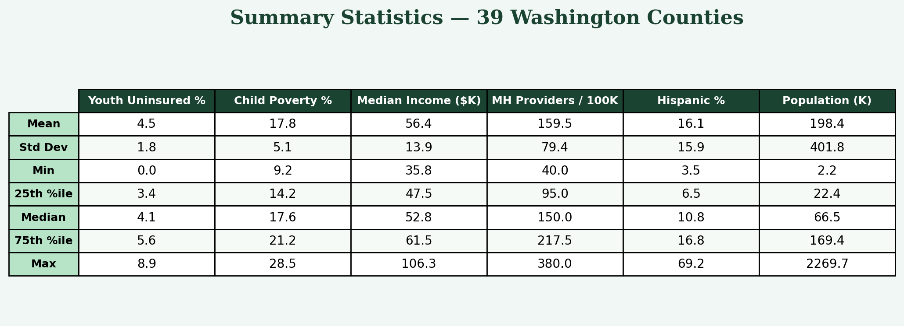

The summary table shows considerable variation across Washington's 39 counties. Youth uninsured rates range from 0.0% (Garfield) to 8.9% (Skamania), while mental health provider density spans a 9.5x gap between the least-served county (Garfield, 40 per 100K) and the best-served (King, 380 per 100K). Median household income ranges from $35,800 (Whitman) to $106,300 (King). Youth MH diagnosis rates range from 16.2% (San Juan) to 26.4% (Yakima).

### Distributions

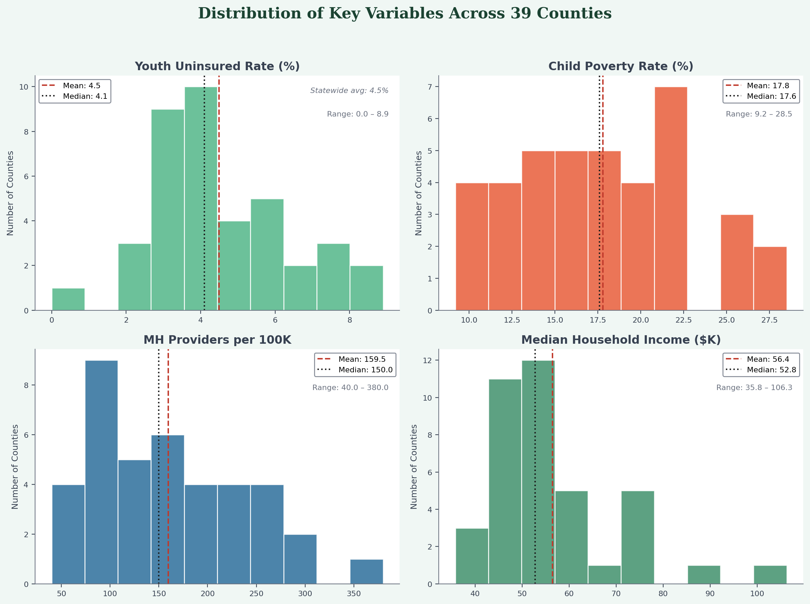

Youth uninsured rates are right-skewed, with most counties falling between 3-6% but a handful of agricultural counties pulling the tail above 7%. Child poverty shows a wider, more uniform spread. Provider density is bimodal — urban counties cluster above 200 per 100K while rural counties cluster below 150. Youth MH diagnosis rates center around 20% with a right tail driven by high-poverty rural counties. Youth sadness prevalence averages 43.8%, well above the national average of ~42%.

### Rural vs. Urban Disparities

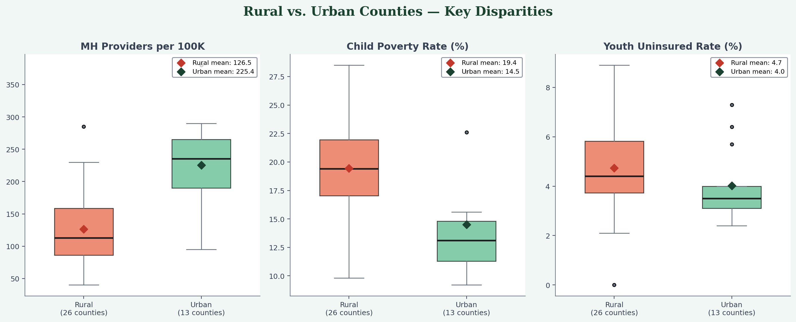

Box plots reveal consistent disadvantage across rural counties (26 of 39). Rural counties average fewer mental health providers, higher child poverty, and higher youth uninsured rates compared to the 13 urban counties. The provider gap is the most pronounced disparity.

### Provider Ranking

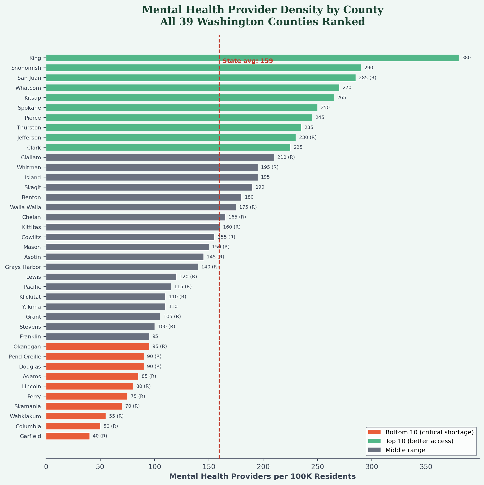

A full ranking of all 39 counties by mental health provider density. The five most underserved counties — Garfield (40), Columbia (50), Wahkiakum (55), Skamania (70), and Ferry (75) — are all rural with populations under 13,000. The top five — King (380), Snohomish (290), San Juan (285), Whatcom (270), and Kitsap (265) — are predominantly urban or high-income.

### Income vs. Provider Access

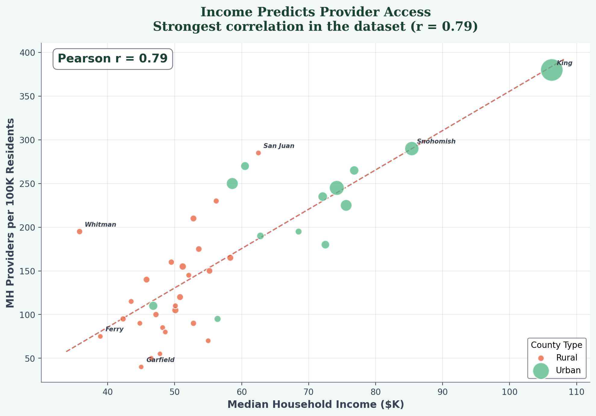

The strongest relationship in the dataset: median household income correlates with mental health provider density at r = 0.79. Bubble size represents county population. The scatter plot shows that wealthier counties tend to have higher provider density, while low-income rural counties face compounding disadvantages. King County is a clear outlier with both the highest income and highest provider rate.

### Correlation Heatmap

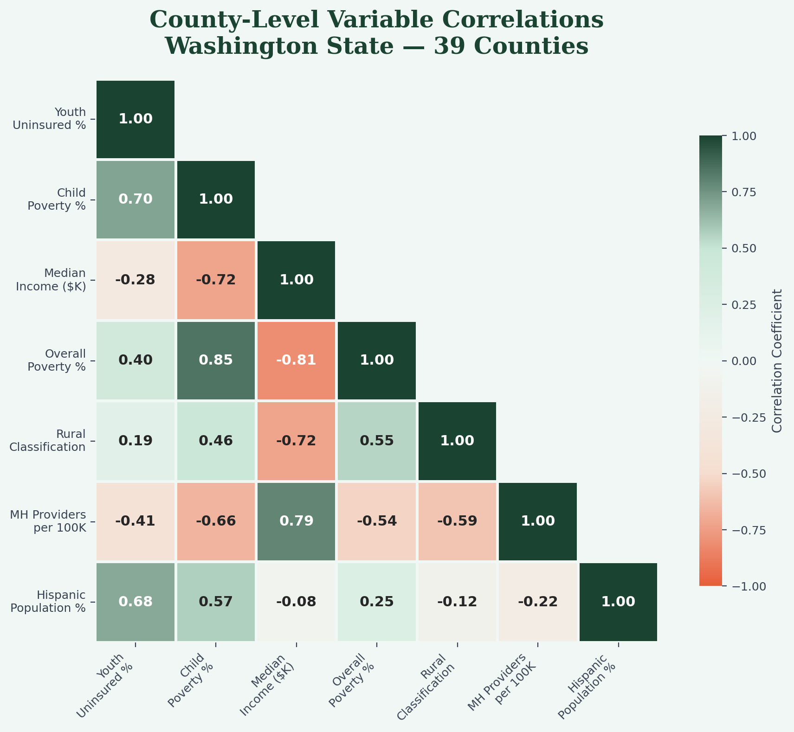

The full correlation matrix across all 11 county-level variables highlights several expected associations and surfaces additional patterns. Income and providers show the strongest positive link (r = 0.79). Youth sadness and child poverty correlate at r = 0.96. Adult MH days and youth sadness track at r = 0.98 — counties where adults report more mentally unhealthy days are the same counties where youth report persistent sadness. Child maltreatment correlates strongly with poverty (r = 0.90) and inversely with income (r = -0.63). Hispanic population percentage correlates with youth uninsured rates (r = 0.68). Because the analysis includes only 39 counties and some indicators are survey-based or proxy-derived, very high correlations (r > 0.90) should be interpreted as strong exploratory county-level signals rather than causal proof.

### K-Means Clustering

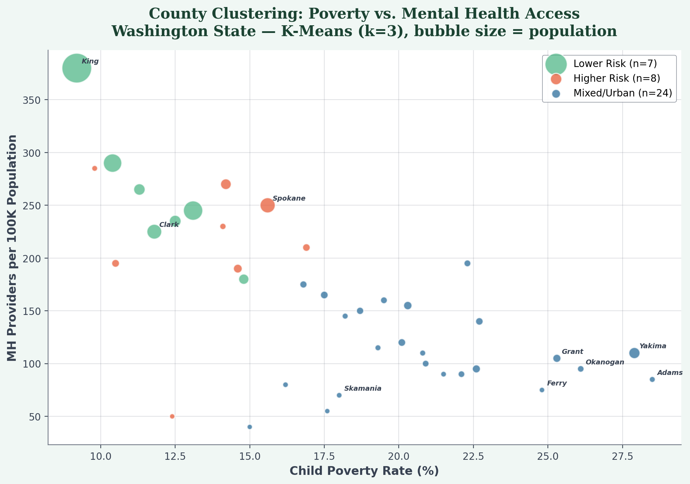

Counties are clustered into three risk profiles using a from-scratch K-means implementation (k=3) on standardized values of youth uninsured rate, child poverty, provider density, and median income. The three groups separate into lower-risk (low poverty, high providers), higher-risk (high poverty, low providers), and mixed/urban profiles. Bubble size represents population.

### Geographic Distribution

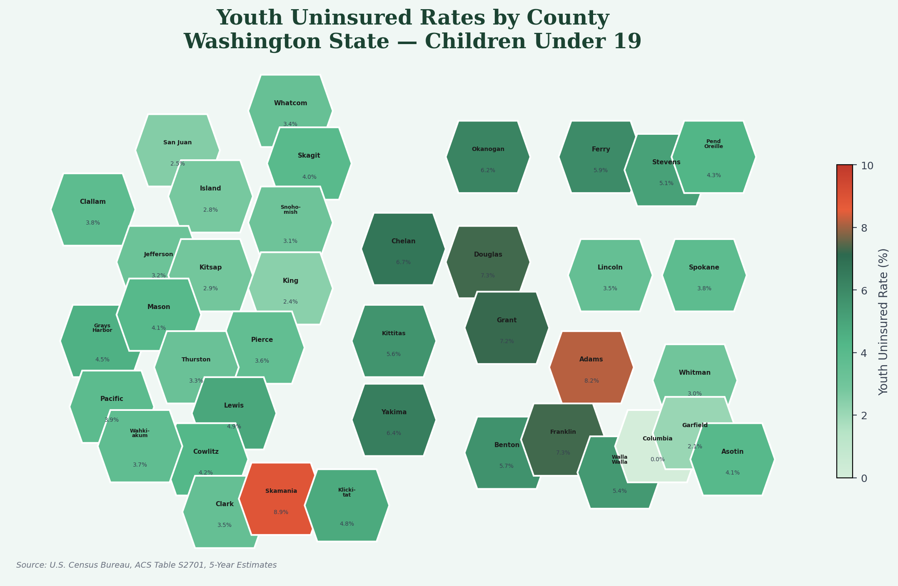

A hex cartogram showing youth uninsured rates across all 39 counties. Eastern agricultural counties (Adams, Skamania, Grant, Franklin, Douglas) show the highest rates, while western urban counties (King, Island, San Juan) have the lowest. The geographic pattern closely mirrors the income and provider gradients seen in earlier figures.

### Youth MH Prevalence

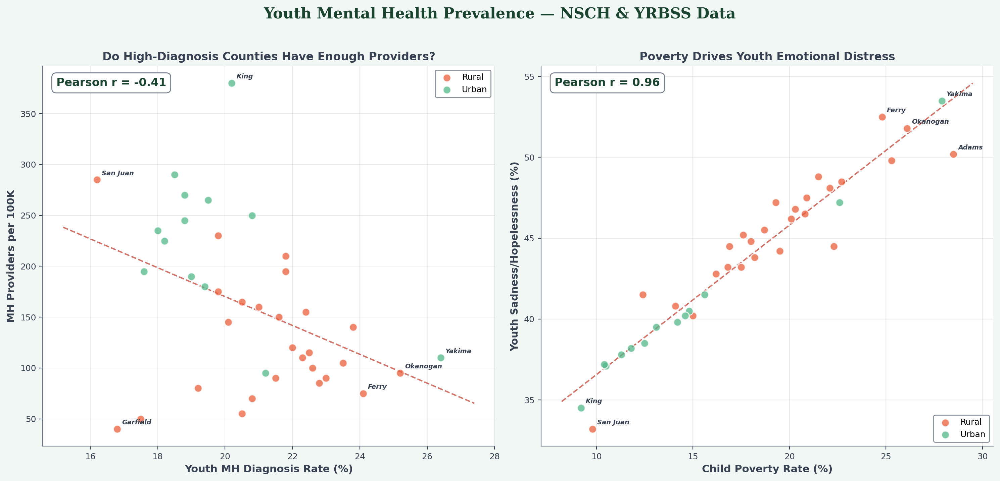

Two-panel figure examining youth mental health outcomes. The left panel plots youth MH diagnosis rates (NSCH) against provider density, revealing a negative correlation (r = -0.41) — counties with fewer providers tend to have higher diagnosis rates, suggesting that higher need in underserved areas may outpace the available diagnostic capacity. The right panel shows youth sadness prevalence (YRBSS) vs. child poverty, with a striking r = 0.96 correlation indicating that child poverty is the strongest county-level correlate of adolescent emotional distress in this dataset.

### Child Maltreatment Analysis

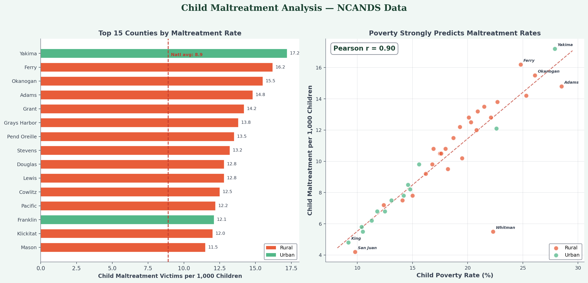

County rankings by child maltreatment rate (NCANDS) alongside poverty correlation. Yakima (17.2 per 1K), Ferry (16.2), and Okanogan (15.5) have the highest rates. Maltreatment correlates strongly with child poverty (r = 0.90) and inversely with income (r = -0.63), indicating that economic hardship is strongly associated with maltreatment at the county level.

### Caregiver Access Barriers

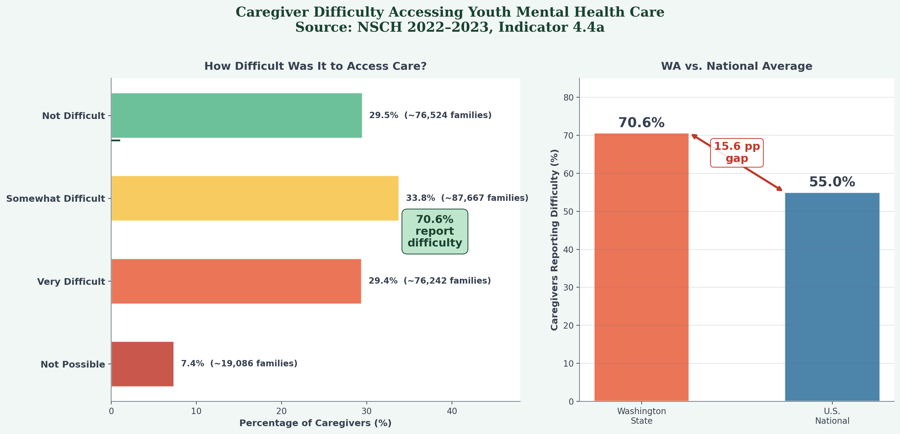

State-level survey data from NSCH (Indicator 4.4a, 2022–2023) reveals that **70.6% of Washington caregivers who sought mental health care for their children reported difficulty obtaining it**. Only 29.5% said the process was not difficult, while 33.8% found it somewhat difficult, 29.4% very difficult, and 7.4% said it was not possible. This represents approximately 182,995 Washington families encountering barriers. Washington's 70.6% difficulty rate exceeds the national average of 55.0% by 15.6 percentage points, placing Washington well above the national average in caregiver-reported difficulty.

---

## Key Findings

1. **70.6% of caregivers report difficulty accessing youth MH care.** Among Washington families who sought mental health care for their children, 70.6% reported some form of difficulty (NSCH 2022–2023). This is 15.6 percentage points above the national average of 55.0%, representing approximately 183,000 families encountering barriers.

2. **Rural-urban provider gap.** Rural counties average 127 providers per 100K vs. 225 in urban counties — a gap of 99 fewer providers per 100K affecting 26 of 39 counties.

3. **Income is strongly associated with access.** Median household income and provider density correlate at r = 0.79, the strongest relationship in the dataset. Wealthier counties tend to have higher provider density.

4. **Poverty is the strongest correlate of youth sadness.** Child poverty and youth sadness/hopelessness correlate at r = 0.96, the tightest link between any socioeconomic factor and a mental health outcome in this analysis. Adult and youth mental health burden also track closely (r = 0.98), suggesting that family- and community-level mental health conditions should be considered alongside youth-specific measures when planning outreach.

5. **Child maltreatment tracks closely with poverty.** Maltreatment rates correlate with child poverty at r = 0.90 and inversely with income at r = -0.63. Yakima (17.2/1K), Ferry (16.2), and Okanogan (15.5) have the highest rates.

6. **Five critical provider-shortage counties.** Garfield (40 providers/100K), Columbia (50), Wahkiakum (55), Skamania (70), and Ferry (75) represent the most acute access deserts — all rural, all with populations under 13,000.

7. **Uninsured rate extremes.** Skamania (8.9%), Adams (8.2%), and Franklin/Douglas (7.3%) have the highest youth uninsured rates, an 8.9 percentage point gap compared to the lowest.

8. **Demographic barriers.** Hispanic population percentage correlates with youth uninsured rates (r = 0.68), pointing to potential enrollment barriers in communities like Adams (69% Hispanic, 8.2% uninsured) and Franklin (56% Hispanic, 7.3% uninsured).

9. **Youth MH diagnosis paradox.** Counties with fewer providers show higher diagnosis rates (r = -0.41), suggesting that higher need in these areas may outpace the available diagnostic capacity.

10. **Youth MH prevalence.** State average of 20.8% of children 3-17 have an anxiety/depression diagnosis (NSCH), with Yakima (26.4%), Okanogan (25.2%), and Ferry (24.1%) highest.

---

## Recommendations

1. **Target provider recruitment in the five critical counties** — Garfield, Columbia, Wahkiakum, Skamania, and Ferry lack the population base to sustain private-practice models. Telehealth subsidies or state-funded provider rotations could help bridge the gap.

2. **Expand insurance outreach in high-Hispanic communities** — The correlation between Hispanic population share and youth uninsured rates suggests language and documentation barriers to enrollment, not necessarily lack of program eligibility. Bilingual navigators and community-based enrollment drives should be prioritized in Adams, Franklin, Grant, and Yakima counties.

3. **Use clustering to inform prioritization** — The three risk profiles identified by K-means can serve as one structured input for tiered resource allocation, alongside local context and service data: higher-risk counties may benefit from intensive, targeted intervention; mixed counties from targeted support; and lower-risk counties from maintenance funding.

4. **Invest in rural infrastructure** — The consistent rural disadvantage across providers, poverty, and insurance coverage reflects systemic underinvestment. Broadband expansion for telehealth, loan forgiveness for rural mental health professionals, and mobile crisis teams would help address structural barriers.

5. **Address the caregiver access gap** — With 70.6% of families reporting difficulty and a 15.6-point gap above the national average, Washington would benefit from systemic reforms: shorter wait times, expanded telehealth, streamlined referral pathways, and family navigators to reduce the burden of accessing care.

6. **Prioritize child maltreatment prevention in high-poverty counties** — Yakima, Ferry, and Okanogan should receive targeted family support services, as maltreatment rates track poverty at r = 0.90.

---

## Limitations

This analysis is a county-level ecological study. All findings describe associations between aggregate county indicators and should not be interpreted as individual-level causation. A high county-level correlation between poverty and youth sadness, for example, does not mean that any individual child living in poverty will experience sadness — it means that counties with higher poverty rates tend to report higher sadness prevalence in aggregate.

Correlation does not prove causation. The Pearson correlations reported throughout this analysis quantify the strength and direction of linear associations between county-level indicators. They do not establish that one variable causes changes in another. Unmeasured confounders, shared demographic structures, and the small sample size (n = 39 counties) can all influence correlation estimates. Very high correlations (r > 0.90) in particular should be interpreted as strong exploratory signals warranting further investigation, not as definitive proof of a mechanism.

Several of the youth mental health indicators used in this analysis are survey-based, modeled, or proxy-derived rather than direct county-level clinical measurements. NSCH and YRBSS data originate from state-level surveys and are allocated to counties using demographic weighting. BRFSS estimates are similarly survey-based. These allocation methods are standard in public health research but introduce estimation uncertainty that is not reflected in the correlation coefficients.

The K-means clustering (k=3) is used as exploratory county segmentation to identify groups with similar access and risk profiles. It is not a predictive model and should not be treated as one. The cluster assignments are sensitive to the choice of k, the variables included, and the random seed. They are useful for structuring discussion about which counties share similar characteristics, but they should be validated against local program data and expert knowledge before being used to guide funding or policy decisions.

The caregiver access finding (70.6% reporting difficulty) comes from the NSCH, a nationally representative caregiver-reported survey. Survey-based measures may reflect reporting bias — caregivers who are more engaged with the health system may be more likely to respond — and the state-level estimate carries a margin of error not shown in the figure.

This analysis is intended to support needs assessment, outreach planning, and resource prioritization. It is not intended for clinical diagnosis, individual-level inference, or definitive policy prescription. The findings are strongest when used alongside local expertise, program-level data, and community input.

---

## Relevance to WSCC

This project was completed as part of a Spring 2026 internship with **Washington State Community Connectors (WSCC)**, an organization dedicated to bridging gaps in health and social services across Washington's rural and underserved communities.

The analysis maps directly to WSCC's mission and operational needs:

- **Geographic targeting** — The county-level maps and provider rankings identify where youth mental health services are most lacking, supporting WSCC's outreach resource allocation and grant applications.
- **Risk segmentation** — The K-means clustering groups counties with similar access and risk profiles, providing one structured input for prioritization that aligns with how state agencies and nonprofits allocate intervention resources.
- **Evidence-based advocacy** — The correlation analysis quantifies the associations between poverty, insurance coverage, provider access, youth sadness, and child maltreatment — the factors WSCC tracks when assessing whether programs are reaching the populations most at risk.
- **Caregiver access data** — The 70.6% caregiver difficulty finding from NSCH provides a powerful headline statistic for grant applications and advocacy materials, directly illustrating the access barriers WSCC works to reduce.

This project demonstrates the end-to-end data workflow involved in community health analytics: sourcing federal datasets, integrating multiple data streams at the county level, applying statistical and machine learning techniques, and producing outputs that directly support program planning.

---

## Repository Structure

youth-mental-health-wa/
├── Code.py                          # Full analysis script (all data embedded)
├── data/
│   └── sources.md                   # Dataset documentation and download links
├── outputs/
│   ├── summary_stats.png            # Fig 1: Summary statistics table
│   ├── distributions.png            # Fig 2: Variable distributions (2x3)
│   ├── rural_vs_urban.png           # Fig 3: Rural vs urban box plots
│   ├── top_bottom_providers.png     # Fig 4: Provider density ranking
│   ├── income_vs_providers.png      # Fig 5: Income vs providers (r = 0.79)
│   ├── heatmap.png                  # Fig 6: Correlation matrix (11 variables)
│   ├── clustering.png               # Fig 7: K-means risk profiles (k=3)
│   ├── gis_map.png                  # Fig 8: Hex cartogram
│   ├── youth_mh_prevalence.png      # Fig 9: Youth MH diagnosis & sadness
│   ├── maltreatment_analysis.png    # Fig 10: Child maltreatment rankings
│   └── caregiver_access_barriers.png # Fig 11: Caregiver access difficulty (NSCH)
├── requirements.txt
├── LICENSE
└── .gitignore

---

## How to Run

```bash
pip install pandas numpy matplotlib seaborn
python Code.py
```

All 11 figures are saved to `outputs/`. No external data files are needed — the county data is embedded in the script.

---

## Copyright

© 2026 Waleed Adawi. All rights reserved.

This project and its contents are shared for portfolio and educational purposes. Developed during a Spring 2026 internship with Washington State Community Connectors (WSCC). Data sourced from U.S. Census Bureau (ACS), HRSA, USDA, NSCH, YRBSS, BRFSS, and NCANDS — all publicly available federal datasets. See [`data/sources.md`](data/sources.md) for full citations.

Licensed under the [MIT License](LICENSE).
